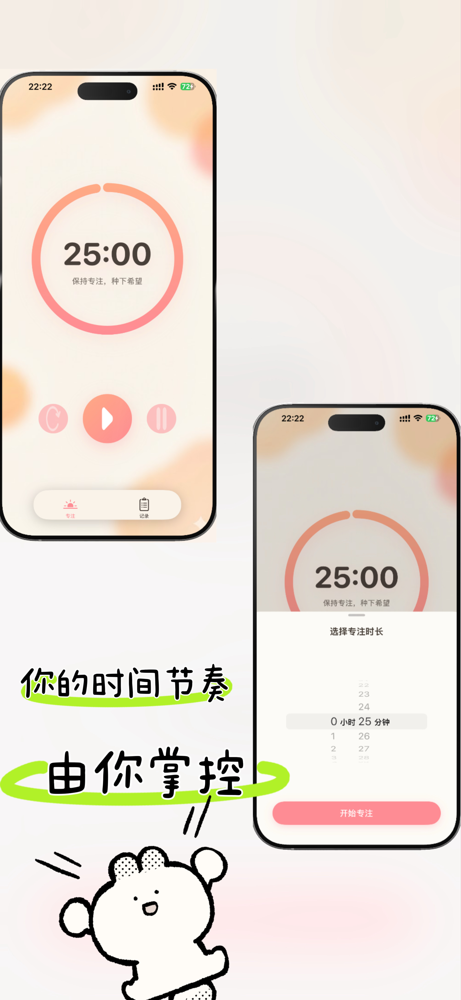
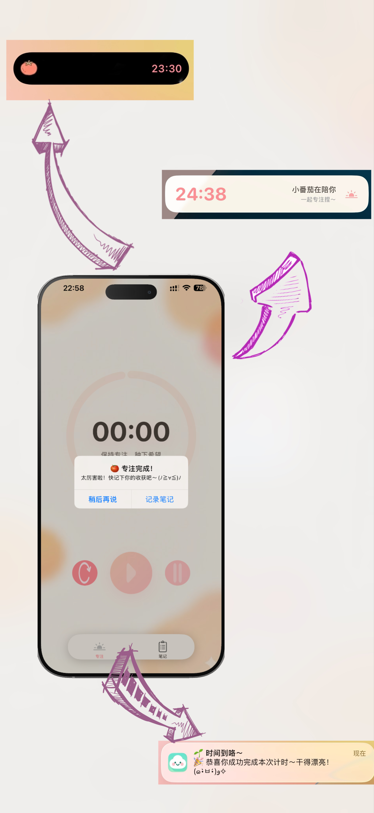

# FocusNotes 📝
让专注变得柔软，有呼吸感。


一个简洁、温馨的专注计时与笔记 App，陪你专注每一刻，并在结束后安静地写下属于你的思考与成长。


🌸已上架 [App Store](https://apps.apple.com/app/focusnotes/id6755492518) 欢迎来玩！你的专注，值得被温柔记录～


## ✨ 特色功能

### 🍅 专注计时
- **灵动岛支持**：计时过程实时显示在 Dynamic Island 和锁屏界面
- **温馨提醒**：计时结束播放自定义提示音 `notification.caf`
- **后台通知**：即使 App 在后台，也能收到计时完成提醒
- **灵活时长**：支持 25 分钟经典番茄钟或自定义时长
- **优雅 UI**：使用温馨的珊瑚粉和米白色主题

### 📔 笔记记录
- **快速创建**：计时结束后可直接跳转到笔记页面
- **自由编辑**：随时修改、补充或删除笔记内容
- **简洁设计**：专注于内容记录，避免复杂功能干扰
- **本地存储**：无需账号，所有数据本地保存

## 🎨 设计理念

> 市面上很多效率工具，都在追求“更快”“更多”“更强”。  
> 但我想做一点不同的：**让专注变得柔软、有呼吸感**。  
>   
> 所以 FocusNotes 没有排行榜，没有社交，没有积分，  
> 只有一颗陪你安静成长的小番茄 🌱。  
>   
> **快，是世界的节奏；慢，才是专注的本质。**

我们相信：
- **小而美** > 功能堆砌  
- **陪伴感** > 数据竞赛  
- **内心平静** > 外在激励  

因此，这里没有干扰，只有你、时间和一颗正在发芽的希望。

## 📱 App预览图

| 欢迎界面 | 笔记列表 | 笔记详情 |
|:---:|:---:|:---:|
|  |  | |

| 专注页 | 通知页 |
|:---:|:---:|
|  |  |


## 🛠 技术栈

- **主应用**：Objective-C + UIKit
- **灵动岛**：Swift + SwiftUI + ActivityKit
- **本地通知**：UserNotifications Framework
- **音频播放**：AVFoundation
- **数据存储**：NSKeyedArchiver

## 📂 项目结构

```
FocusNotes/
├── FocusNotes/                 # 主应用
│   ├── TimeVC.m               # 主计时页面
│   ├── LiveActivityManager.swift  # 灵动岛管理器
│   ├── FocusTimerAttributes.swift # Live Activity 数据模型
│   ├── NotesTableViewController.m # 笔记列表
│   └── Assets.xcassets/       # 图标资源
└── FocusTimerWidget/          # 小组件扩展
    ├── FocusTimerWidgetLiveActivity.swift # 灵动岛 UI
    └── Assets.xcassets/       # Widget 专用资源
```

## ⚙️ 环境要求

- **iOS 16.0+** (Live Activity 支持)
- **iPhone 14 Pro+** (Dynamic Island 支持)
- **Xcode 15.0+**
- **Swift 5.9+**

## 🚀 构建 & 运行

1. **克隆项目**
   ```bash
   git clone https://github.com/TvT669/FocusNotes.git
   cd FocusNotes
   ```

2. **打开项目**
   ```bash
   open FocusNotes.xcodeproj
   ```

3. **配置 Team ID**
   - 在 Xcode 中选择 Project → Signing & Capabilities
   - 设置你的 Apple Developer Team
   - 确保 Live Activities 权限已启用

4. **运行**
   - 选择 iPhone 14 Pro 或更新设备
   - 按 ⌘R 运行项目

## 🎯 使用方法

1. **开始专注**：点击播放按钮开始计时
2. **查看进度**：通过灵动岛实时查看倒计时
3. **后台运行**：退到桌面，灵动岛继续显示进度
4. **完成提醒**：计时结束后收到声音和通知提醒
5. **记录笔记**：专注结束后快速记下你的想法或收获


## 🤝 贡献

欢迎提交 Issue 和 Pull Request！

## 📄 许可证

MIT License - 详见 [LICENSE](LICENSE) 文件

## 👨‍💻 作者

**TvT669** - [GitHub](https://github.com/TvT669)


---
