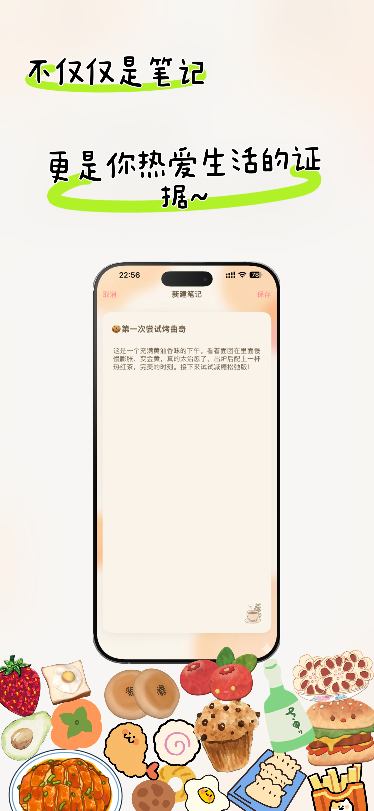

# FocusNotes 📝
让专注变得柔软，有呼吸感。
一个简洁、温馨的专注计时与笔记 App，采用番茄钟工作法帮助你保持专注，并在完成后记录学习成果。
（喵喵喵？真的有人看吗...）(。-`ω´-)

## ✨ 特色功能

### 🍅 专注计时
- **灵动岛支持**：计时过程实时显示在 Dynamic Island 和锁屏界面
- **温馨提醒**：计时结束播放自定义提示音 `notification.caf`
- **后台通知**：即使 App 在后台，也能收到计时完成提醒
- **灵活时长**：支持 25 分钟经典番茄钟或自定义时长
- **优雅 UI**：使用温馨的珊瑚粉和米白色主题

### 📔 笔记记录
- **快速创建**：计时结束后可直接跳转到笔记页面
- **简洁设计**：专注于内容记录，避免复杂功能干扰
- **本地存储**：无需账号，所有数据本地保存

## 🎨 设计理念

> 市面上很多效率工具，都在追求“更快”“更多”“更强”。  
> 但我想做一点不同的：**让专注变得柔软、有呼吸感**。  
>   
> 所以 FocusNotes 没有排行榜，没有社交，没有积分，  
> 只有一颗陪你安静成长的小番茄 🌱。  
>   
> **快，是世界的节奏；慢，才是专注的本质。**

我们相信：
- **小而美** > 功能堆砌  
- **陪伴感** > 数据竞赛  
- **内心平静** > 外在激励  

因此，这里没有干扰，只有你、时间和一颗正在发芽的希望。

## 📱 App预览图

| 专注计时 | 笔记列表 | 笔记详情 |
|:---:|:---:|:---:|
|  |  |  |

| 欢迎页 | 通知页 |
|:---:|:---:|
|  |  |


## 🛠 技术栈

- **主应用**：Objective-C + UIKit
- **灵动岛**：Swift + SwiftUI + ActivityKit
- **本地通知**：UserNotifications Framework
- **音频播放**：AVFoundation
- **数据存储**：Core Data (本地)

## 📂 项目结构

```
FocusNotes/
├── FocusNotes/                 # 主应用
│   ├── TimeVC.m               # 主计时页面
│   ├── LiveActivityManager.swift  # 灵动岛管理器
│   ├── FocusTimerAttributes.swift # Live Activity 数据模型
│   ├── NotesTableViewController.m # 笔记列表
│   └── Assets.xcassets/       # 图标资源
└── FocusTimerWidget/          # 小组件扩展
    ├── FocusTimerWidgetLiveActivity.swift # 灵动岛 UI
    └── Assets.xcassets/       # Widget 专用资源
```

## ⚙️ 环境要求

- **iOS 16.0+** (Live Activity 支持)
- **iPhone 14 Pro+** (Dynamic Island 支持)
- **Xcode 15.0+**
- **Swift 5.9+**

## 🚀 构建 & 运行

1. **克隆项目**
   ```bash
   git clone https://github.com/TvT669/FocusNotes.git
   cd FocusNotes
   ```

2. **打开项目**
   ```bash
   open FocusNotes.xcodeproj
   ```

3. **配置 Team ID**
   - 在 Xcode 中选择 Project → Signing & Capabilities
   - 设置你的 Apple Developer Team
   - 确保 Live Activities 权限已启用

4. **运行**
   - 选择 iPhone 14 Pro 或更新设备
   - 按 ⌘R 运行项目

## 🎯 使用方法

1. **开始专注**：点击播放按钮开始计时
2. **查看进度**：通过灵动岛实时查看倒计时
3. **后台运行**：退到桌面，灵动岛继续显示进度
4. **完成提醒**：计时结束后收到声音和通知提醒
5. **记录笔记**：选择记录本次专注的学习内容


## 🤝 贡献

欢迎提交 Issue 和 Pull Request！

## 📄 许可证

MIT License - 详见 [LICENSE](LICENSE) 文件

## 👨‍💻 作者

**TvT669** - [GitHub](https://github.com/TvT669)

---

*保持专注，种下希望 🌱*

---
本人表达观点仅字面含义，非引战，非水军，非反串，仅为个人感想无任何衍生含义内容不代表任何其他团体个人，无任何隐喻，暗示，反串，碰瓷,蹭热度等想法。本人家庭和睦安康、无任何心理或精神疾病，智力为正常水平。观点及言论仅代表我个人一点浅薄的看法，非专业学术内容仅为个人bb空间，部分内容仅为猜测不代表实际，与本人所在群体、父母亲朋、所在省市地区无关。如有不同观点欢迎礼貌讨论感谢指正。本言论不含有对任何群体的歧视，不含有任何挑起对立的含义。本人认知范围浅薄，无专业团队，内容偏个人想法，如有误会歧义欢迎指正。内容如有雷同纯属巧合。如有疑惑欢迎私信质疑本人一一回复，因私信评论较多时间有限短期未回复不代表无视。未回复也可能是手滑没看到。本人使用字体为免费开源字体无任何恶意侵权行为，内容中如出现他人均已模糊处理，如有侵权请证明关联性作者会尽快处理。本人的表达能力一般，面部表情管理较差,如表情过于欠揍绝非恶意鄙视某个人、团体、群体的含义，评论区网友意见绝非本人想法，不代表本人意思，如有点赞到您不认可的内容纯属手滑,绝非故意针对你个人，你所在群体、团体、组织。本人神经天马行空，常常脱离常识，如有歧义欢迎指正。本人为地球人。热爱地球文化文明，绝无任何反人类倾向,本人承诺未向三体发送过地球坐标，未向任何外星人、异次元文明、其它宇宙、平行宇宙透露过地球信息，本人个人性别为男性，坚定支持男女平等，男女两字的排序不分前后，本人用词较为网络通用口语，绝无任何恶意，绝无任何将严肃话题娱乐化的意图。本人承诺热爱小动物，如把人比喻成狗仅通俗调侃，绝无任何践踏人类人格、尊严、人权等意图，绝无歧视动物的意图。本人素质为平均素质，发表言论不具备任何专业性，仅供参考。本人对自己发表内容会负所有责任。评论中如有不良言论，建议自行拉黑或举报处理，绝非我视而不见置之不理或认可不良内容。内容如有雷同纯属巧合